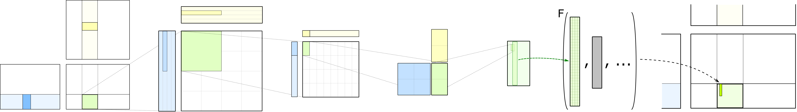

# Functionality (Intel Xe)

Note: SYCL*TLA requires Intel oneAPI 2025.0 or newer, and Intel Xe architecture (PVC/Xe12 or BMG/Xe20), for the target toolkit and architecture, respectively.

- N - Column Major Matrix
- T - Row Major matrix
- {N,T} x {N,T} - All combinations, i.e., NN, NT, TN, TT
- f - floating point
- s - signed int
- u - unsigned int
- b - bit
- bf16 - bfloat16
- tf32 - tfloat32
- f8 (e4m3) - 8-bit float (E4M3 format)
- f8 (e5m2) - 8-bit float (E5M2 format)
- XMX16 - Use Intel Xe Matrix Extensions (XMX) with subgroup size 16
- DPAS - Dot Product Accumulate Systolic instruction

## Intel Xe Architecture Hierarchy

Intel Xe GPUs use the following execution hierarchy:

```
Device (GPU)
  └─ Group (Work Group)
      └─ Subgroup (16 work-items, SIMD execution unit)
          └─ Work-item (Individual thread)
```

**Subgroup Size**: 16 work-items — this is the fundamental execution unit for all Xe MMA and copy operations.

### Supported Intel Xe Architectures

| **Architecture** | **Code Name** | **GPU Examples** | **Arch ID** | **Key Feature** |
|------------------|---------------|------------------|-------------|-----------------|
| **Xe12 (PVC)**   | Ponte Vecchio | Data Center Max 1550/1100 | 12 | DPAS, 2D Block Copy |
| **Xe20 (BMG)**   | Battlemage    | Intel Arc B580    | 20 | DPAS, 2D Block Copy |

PVC and BMG share the same DPAS instruction set and 2D block copy capabilities. All GEMM kernels and features listed below are supported on both architectures.


## Device-level GEMM

The following tables summarize device-level GEMM kernels for Intel Xe, organized by opcode class, data type, and layout.
Hyperlinks to relevant unit tests and examples demonstrate how specific template instances may be defined.

### Standard GEMM Kernels

|**Opcode Class** | **Toolchain** | **Data Type**                  | **Layouts**            | **Test / Example**    |
|-----------------|---------------|--------------------------------|------------------------|-----------------------|
| **XMX16 (DPAS)**  | oneAPI 2025.0+ | `bf16 * bf16 + f32 => f32`     | {N,T} x {N,T} => {N,T} | [test](../../../test/unit/gemm/device/xe_gemm_bf16_bf16_fp32_tensor_op_fp32.cpp), [example](../../../examples/00_bmg_gemm/00_bmg_gemm.cpp) |
| **XMX16 (DPAS)**  | oneAPI 2025.0+ | `bf16 * bf16 + f32 => bf16`    | {N,T} x {N,T} => {N,T} | [test](../../../test/unit/gemm/device/xe_gemm_bf16_bf16_fp32_tensor_op_bf16.cpp) |
| **XMX16 (DPAS)**  | oneAPI 2025.0+ | `bf16 * bf16 + bf16 => bf16`   | {N,T} x {N,T} => {N,T} | [test](../../../test/unit/gemm/device/xe_gemm_bf16_bf16_bf16_tensor_op_bf16.cpp) |
| **XMX16 (DPAS)**  | oneAPI 2025.0+ | `bf16 * bf16 + bf16 => f32`    | {N,T} x {N,T} => {N,T} | [test](../../../test/unit/gemm/device/xe_gemm_bf16_bf16_bf16_tensor_op_fp32.cpp) |
| **XMX16 (DPAS)**  | oneAPI 2025.0+ | `f16 * f16 + f32 => f32`       | {N,T} x {N,T} => {N,T} | [test](../../../test/unit/gemm/device/xe_gemm_fp16_fp16_fp32_tensor_op_fp32.cpp), [example](../../../examples/01_bmg_gemm_with_collective_builder/01_bmg_gemm_with_collective_builder.cpp) |
| **XMX16 (DPAS)**  | oneAPI 2025.0+ | `f16 * f16 + f16 => f16`       | {N,T} x {N,T} => {N,T} | [test](../../../test/unit/gemm/device/xe_gemm_fp16_fp16_fp16_tensor_op_fp16.cpp) |
| **XMX16 (DPAS)**  | oneAPI 2025.0+ | `f16 * f16 + f16 => f32`       | {N,T} x {N,T} => {N,T} | [test](../../../test/unit/gemm/device/xe_gemm_fp16_fp16_fp16_tensor_op_fp32.cpp) |
| **XMX16 (DPAS)**  | oneAPI 2025.0+ | `tf32 * tf32 + f32 => f32`     | {N,T} x {N,T} => {N,T} | [test](../../../test/unit/gemm/device/xe_gemm_tf32_tf32_fp32_tensor_op_fp32.cpp) |
| **XMX16 (DPAS)**  | oneAPI 2025.0+ | `s8 * s8 + s32 => s32`         | {N,T} x {N,T} => {N,T} | [test](../../../test/unit/gemm/device/xe_gemm_s8_s8_s32_tensor_op_s32.cpp) |
| **XMX16 (DPAS)**  | oneAPI 2025.0+ | `f8(e4m3) * f8(e4m3) + f32 => f32` | {N,T} x {N,T} => {N,T} | [test](../../../test/unit/gemm/device/xe_gemm_f8_f8_fp32_tensor_op_fp32.cpp), [example](../../../examples/08_bmg_gemm_f8/08_bmg_gemm_f8.cpp) |

### Cooperative GEMM Kernels

Cooperative kernels split load and MMA threads to reduce L1 cache conflicts and improve performance.

|**Opcode Class** | **Toolchain** | **Data Type**                  | **Layouts**            | **Unit Test**    |
|-----------------|---------------|--------------------------------|------------------------|------------------|
| **XMX16 (DPAS)**  | oneAPI 2025.0+ | `bf16 * bf16 + f32 => f32`     | {N,T} x {N,T} => {N,T} | [test](../../../test/unit/gemm/device/xe_gemm_bf16_bf16_fp32_tensor_op_fp32_cooperative.cpp) |
| **XMX16 (DPAS)**  | oneAPI 2025.0+ | `f16 * f16 + f32 => f32`       | {N,T} x {N,T} => {N,T} | [test](../../../test/unit/gemm/device/xe_gemm_fp16_fp16_fp32_tensor_op_fp32_cooperative.cpp) |
| **XMX16 (DPAS)**  | oneAPI 2025.0+ | `tf32 * tf32 + f32 => f32`     | {N,T} x {N,T} => {N,T} | [test](../../../test/unit/gemm/device/xe_gemm_tf32_tf32_fp32_tensor_op_fp32_cooperative.cpp) |
| **XMX16 (DPAS)**  | oneAPI 2025.0+ | `s8 * s8 + s32 => s32`         | {N,T} x {N,T} => {N,T} | [test](../../../test/unit/gemm/device/xe_gemm_s8_s8_s32_tensor_op_s32_cooperative.cpp) |

### Mixed Precision GEMM Kernels

Mixed precision kernels support different data types for A and B operands.

|**Opcode Class** | **Toolchain** | **Data Type**                  | **Layouts**            | **Test / Example**    |
|-----------------|---------------|--------------------------------|------------------------|-----------------------|
| **XMX16 (DPAS)**  | oneAPI 2025.0+ | `f16 * s8 + f32 => f32`        | {N,T} x {N,T} => {N,T} | [test](../../../test/unit/gemm/device/xe_gemm_fp16_s8_fp32_tensor_op_fp32.cpp) |
| **XMX16 (DPAS)**  | oneAPI 2025.0+ | `f16 * s4 + f32 => f32`        | {N,T} x {N,T} => {N,T} | [test](../../../test/unit/gemm/device/gemm_universal_f16t_s4n_f32t_mixed_input_tensor_op_f32_xe.cpp) |
| **XMX16 (DPAS)**  | oneAPI 2025.0+ | `s8 * bf16 + f32 => f32`       | {N,T} x {N,T} => {N,T} | [test](../../../test/unit/gemm/device/gemm_universal_s8t_bf16n_f32t_mixed_input_tensor_op_f32_xe.cpp) |
| **XMX16 (DPAS)**  | oneAPI 2025.0+ | `f16 * f8(e4m3) + f32 => f32`  | {N,T} x {N,T} => {N,T} | [test](../../../test/unit/gemm/device/xe_gemm_f16_f8_fp32_tensor_op_fp32.cpp) |
| **XMX16 (DPAS)**  | oneAPI 2025.0+ | `bf16 * s8 + f32 => bf16`      | {N,T} x {N,T} => {N,T} | [example](../../../examples/02_bmg_gemm_mixed_dtype/02_bmg_gemm_bf16_s8_bf16.cpp) |

### Grouped GEMM Kernels

Grouped GEMM (batched with different sizes) is supported for efficient MoE and multi-head attention workloads.

|**Opcode Class** | **Toolchain** | **Data Type**                  | **Layouts**            | **Test / Example**    |
|-----------------|---------------|--------------------------------|------------------------|-----------------------|
| **XMX16 (DPAS)**  | oneAPI 2025.0+ | `bf16 * bf16 + f32 => f32`     | {N,T} x {N,T} => {N,T} | [test](../../../test/unit/gemm/device/xe_gemm_bf16_bf16_fp32_tensor_op_fp32_group_gemm.cpp), [example](../../../examples/04_bmg_grouped_gemm/04_bmg_grouped_gemm.cpp) |
| **XMX16 (DPAS)**  | oneAPI 2025.0+ | `bf16 * bf16 + bf16 => f32`    | {N,T} x {N,T} => {N,T} | [test](../../../test/unit/gemm/device/xe_gemm_bf16_bf16_bf16_tensor_op_fp32_group_gemm.cpp) |
| **XMX16 (DPAS)**  | oneAPI 2025.0+ | `f16 * f16 + f16 => f32`       | {N,T} x {N,T} => {N,T} | [test](../../../test/unit/gemm/device/xe_gemm_fp16_fp16_fp16_tensor_op_fp32_group_gemm.cpp) |
| **XMX16 (DPAS)**  | oneAPI 2025.0+ | `f16 * f16 + f32 => f32`       | {N,T} x {N,T} => {N,T} | [test](../../../test/unit/gemm/device/xe_gemm_fp16_fp16_fp32_tensor_op_fp32_group_gemm.cpp) |
| **XMX16 (DPAS)**  | oneAPI 2025.0+ | `bf16 * s8 + f32 => f32`       | {N,T} x {N,T} => {N,T} | [test](../../../test/unit/gemm/device/xe_gemm_bf16_s8_fp32_tensor_op_fp32_group_gemm.cpp) |
| **XMX16 (DPAS)**  | oneAPI 2025.0+ | `bf16 * u4 + f32 => f32`       | {N,T} x {N,T} => {N,T} | [test](../../../test/unit/gemm/device/xe_gemm_bf16_u4_fp32_tensor_op_fp32_group_gemm.cpp) |
| **XMX16 (DPAS)**  | oneAPI 2025.0+ | `f16 * s8 + f32 => f32`        | {N,T} x {N,T} => {N,T} | [test](../../../test/unit/gemm/device/xe_gemm_fp16_s8_fp32_tensor_op_fp32_group_gemm.cpp) |
| **XMX16 (DPAS)**  | oneAPI 2025.0+ | `f16 * u4 + f32 => f32`        | {N,T} x {N,T} => {N,T} | [test](../../../test/unit/gemm/device/xe_gemm_fp16_u4_fp32_tensor_op_fp32_group_gemm.cpp) |
| **XMX16 (DPAS)**  | oneAPI 2025.0+ | `f16 * f8(e4m3) + f32 => f32`  | {N,T} x {N,T} => {N,T} | [test](../../../test/unit/gemm/device/xe_gemm_fp16_fp8_fp32_tensor_op_fp32_group_gemm.cpp) |
| **XMX16 (DPAS)**  | oneAPI 2025.0+ | `bf16 * s8 + f32 => f32`       | {N,T} x {N,T} => {N,T} | [example](../../../examples/10_bmg_grouped_gemm_mixed_dtype/) |
| **XMX16 (DPAS)**  | oneAPI 2025.0+ | `f8 * f8 + f32 => f32`         | {N,T} x {N,T} => {N,T} | [example](../../../examples/09_bmg_grouped_gemm_f8/) |

### Ptr-Array Cooperative GEMM

|**Opcode Class** | **Toolchain** | **Data Type**                  | **Layouts**            | **Unit Test**    |
|-----------------|---------------|--------------------------------|------------------------|------------------|
| **XMX16 (DPAS)**  | oneAPI 2025.0+ | `f16 * f16 + f32 => f32`       | {N,T} x {N,T} => {N,T} | [test](../../../test/unit/gemm/device/xe_gemm_fp16_fp16_f32_ptr_array_cooperative.cpp) |

### Epilogue Visitor Tree (EVT) GEMM

EVT enables fused epilogue operations such as ReLU activation, bias addition, softmax reduction, and split-K.

|**Opcode Class** | **Toolchain** | **Data Type**                  | **Layouts**            | **Unit Test**    |
|-----------------|---------------|--------------------------------|------------------------|------------------|
| **XMX16 (DPAS)**  | oneAPI 2025.0+ | `bf16 * bf16 + f32 => f32`     | {N,T} x {N,T} => {N,T} | [test](../../../test/unit/gemm/device/xe_gemm_bf16_bf16_fp32_tensor_op_fp32_evt.cpp) |

### Additional Advanced Features

|**Feature** | **Toolchain** | **Data Type**                  | **Example**    |
|------------|---------------|--------------------------------|----------------|
| **Stream-K GEMM**      | oneAPI 2025.0+ | `bf16 * bf16 + f32 => f32`    | [example](../../../examples/03_bmg_gemm_streamk/03_bmg_gemm_streamk.cpp) |
| **Dual GEMM**          | oneAPI 2025.0+ | `bf16 * bf16 + f32 => f32`    | [example](../../../examples/07_bmg_dual_gemm/07_bmg_dual_gemm.cpp) |
| **MoE GEMM**           | oneAPI 2025.0+ | `bf16 * bf16 + f32 => f32`    | [example](../../../examples/12_xe20_moe_gemm_cute_interface/12_xe20_moe_gemm_cute_interface.cpp) |
| **Flash Attention V2**  | oneAPI 2025.0+ | `bf16 / f16`                  | [example](../../../examples/06_bmg_flash_attention/06_xe_fmha_fwd.cpp) |
| **Epilogue Fusion (ReLU, Bias)** | oneAPI 2025.0+ | `bf16 * bf16 + f32 => f32` | [example](../../../examples/05_bmg_gemm_with_epilogues/05_bmg_gemm_with_epilogue_relu.cpp) |
| **CUTLASS Library**     | oneAPI 2025.0+ | `bf16 * bf16 + f32 => f32`    | [example](../../../examples/11_xe20_cutlass_library/xe20_cutlass_library_b16.cpp) |
| **Bias Addition**       | oneAPI 2025.0+ | `bf16 * bf16 + f32 => f32`    | [example](../../../examples/13_bmg_gemm_bias/13_bmg_gemm_bias.cpp) |


## Subgroup-level Matrix Multiply with DPAS (Intel Xe Matrix Extensions)

All Intel Xe MMA (Matrix Multiply Accumulate) operations are executed at the **subgroup level** (16 work-items cooperating as one SIMD unit), using the DPAS (Dot Product Accumulate Systolic) instruction.

### DPAS Instruction Shape

The DPAS instruction has the following parameterized shape:

```
XE_DPAS_TT<M, TypeD, TypeA, TypeB, TypeC>
```

- **M** (Repeat Count): 1, 2, 4, or 8
- **N**: Fixed at 16 (one per work-item in the subgroup)
- **K**: Derived from data type: `K = 256 / max(sizeof_bits(TypeA), sizeof_bits(TypeB))`

### Supported DPAS Shapes and Data Types

The following table summarizes supported DPAS configurations:

|**Opcode Class** | **Instruction Shape (M×N×K)** | **Data Types (D, A, B, C)**                                  |
|-----------------|-------------------------------|--------------------------------------------------------------|
| **DPAS**        | {1-8} × 16 × 8               | `f32, tf32, tf32, f32`                                       |
| **DPAS**        | {1-8} × 16 × 16              | `f32, bf16, bf16, f32`                                       |
| **DPAS**        | {1-8} × 16 × 16              | `bf16, bf16, bf16, f32`                                      |
| **DPAS**        | {1-8} × 16 × 16              | `f32, bf16, bf16, bf16`                                      |
| **DPAS**        | {1-8} × 16 × 16              | `bf16, bf16, bf16, bf16`                                     |
| **DPAS**        | {1-8} × 16 × 16              | `f32, f16, f16, f32`                                         |
| **DPAS**        | {1-8} × 16 × 16              | `f32, f16, f16, f16`                                         |
| **DPAS**        | {1-8} × 16 × 16              | `f16, f16, f16, f32`                                         |
| **DPAS**        | {1-8} × 16 × 16              | `f16, f16, f16, f16`                                         |
| **DPAS**        | {1-8} × 16 × 32              | `u32, u8, u8, u32`                                           |
| **DPAS**        | {1-8} × 16 × 32              | `s32, u8, u8, s32`                                           |
| **DPAS**        | {1-8} × 16 × 32              | `s32, u8, s8, s32`                                           |
| **DPAS**        | {1-8} × 16 × 32              | `s32, s8, u8, s32`                                           |
| **DPAS**        | {1-8} × 16 × 32              | `s32, s8, s8, s32`                                           |
| **DPAS**        | {1-8} × 16 × 64              | `u32, u4, u4, u32`                                           |
| **DPAS**        | {1-8} × 16 × 64              | `s32, u4, u4, s32`                                           |
| **DPAS**        | {1-8} × 16 × 64              | `s32, u4, s4, s32`                                           |
| **DPAS**        | {1-8} × 16 × 64              | `s32, s4, u4, s32`                                           |
| **DPAS**        | {1-8} × 16 × 64              | `s32, s4, s4, s32`                                           |

Additionally, mixed 8-bit/4-bit DPAS configurations are supported for asymmetric quantized GEMM:

|**Opcode Class** | **Instruction Shape (M×N×K)** | **Data Types (D, A, B, C)**                                  |
|-----------------|-------------------------------|--------------------------------------------------------------|
| **DPAS**        | {1-8} × 16 × 64              | `u32, u8, u4, u32`                                           |
| **DPAS**        | {1-8} × 16 × 64              | `s32, u8, u4, s32`                                           |
| **DPAS**        | {1-8} × 16 × 64              | `s32, u8, s4, s32`                                           |
| **DPAS**        | {1-8} × 16 × 64              | `s32, s8, u4, s32`                                           |
| **DPAS**        | {1-8} × 16 × 64              | `s32, s8, s4, s32`                                           |
| **DPAS**        | {1-8} × 16 × 64              | `u32, u4, u8, u32`                                           |
| **DPAS**        | {1-8} × 16 × 64              | `s32, u4, u8, s32`                                           |
| **DPAS**        | {1-8} × 16 × 64              | `s32, u4, s8, s32`                                           |
| **DPAS**        | {1-8} × 16 × 64              | `s32, s4, u8, s32`                                           |
| **DPAS**        | {1-8} × 16 × 64              | `s32, s4, s8, s32`                                           |


## DPAS Register Layout

DPAS instructions require specific register layouts for operands. These layouts are managed internally by CuTe and the CUTLASS collective abstraction.

### Register Layout for DPAS Operands

|**Operand**|**Layout**          | **Description**                                              |
|-----------|--------------------|--------------------------------------------------------------|
| **A**     | M × K, row-major   | Work-item interleaved: each work-item holds M/sg_size rows   |
| **B**     | K × 16, VNNI       | VNNI-transformed row-major, work-item interleaved across N=16|
| **C/D**   | M × 16, row-major  | Work-item interleaved: each work-item holds M values across N|

**VNNI Transform**: The B matrix is stored in VNNI (Variable-width Non-uniform Narrow Integer) format, which packs multiple narrow elements into wider registers for efficient systolic array feeding.


## 2D Block Copy Operations (Intel Xe)

Intel Xe GPUs feature hardware-accelerated 2D block copy operations for efficient data movement between global memory and registers. All 2D block operations are executed at the **subgroup level** with 16 work-items cooperating.

### Parameterized 2D Block Copy Templates

The current (non-legacy) 2D block copy operations use parameterized templates:

```
XE_LOAD_2D<Bits, Height, Width, BlockWidth>       // Row-major load
XE_LOAD_2D_VNNI<Bits, Height, Width, BlockWidth>  // VNNI-transformed load
XE_LOAD_2D_TRANSPOSE<Bits, Height, Width>          // Transpose load
XE_PREFETCH_2D<Bits, Height, Width>                // Prefetch to cache
XE_STORE_2D<Bits, Height, Width>                   // Row-major store
```

| Parameter    | Meaning                                                  |
|--------------|----------------------------------------------------------|
| `Bits`       | Element width in bits (8, 16, 32, 64)                    |
| `Height`     | Block height in elements                                 |
| `Width`      | Block width in elements                                  |
| `BlockWidth` | Optional: number of blocks for wide loads                |

### Supported 2D Block Operations

|**Operation Template** | **Data Width** | **Use Case**                              |
|-----------------------|----------------|-------------------------------------------|
| `XE_LOAD_2D`          | 8/16/32/64-bit | Row-major load from global memory         |
| `XE_LOAD_2D_VNNI`     | 8/16-bit       | VNNI-transformed load for B operand       |
| `XE_LOAD_2D_TRANSPOSE`| 32/64-bit      | Transpose load from global memory         |
| `XE_PREFETCH_2D`      | All            | Prefetch data to cache                    |
| `XE_STORE_2D`         | 8/16/32/64-bit | Row-major store to global memory          |

### 2D Block Copy Alignment Requirements

| Requirement          | Value                |
|----------------------|----------------------|
| Base address         | 64-byte aligned      |
| Stride (pitch)       | 16-byte aligned      |
| Width                | 4-byte aligned       |
| Max width/pitch      | 2^24 bytes           |
| Max height           | 2^24 elements        |


## Kernel Dispatch Policies (Intel Xe)

Intel Xe kernels use specialized dispatch policies that configure the mainloop and epilogue behaviors.

### Mainloop Dispatch Policies

|**Policy**                                     | **Description**                                          |
|-----------------------------------------------|----------------------------------------------------------|
| `MainloopIntelXeXMX16<Stages>`                | Standard XMX16 mainloop with configurable pipeline depth |
| `MainloopIntelXeXMX16Group<Stages>`           | Grouped GEMM mainloop variant                            |
| `MainloopIntelXeXMX16MixedPrecision<Stages>`  | Mixed precision operand support                          |
| `MainloopIntelXeXMX16GroupMixedPrecision<Stages>` | Grouped GEMM with mixed precision                    |
| `MainloopIntelXeXMX16FP8Scaling<Stages>`      | FP8 with hardware scaling factors                        |
| `MainloopIntelW8A8<Stages>`                   | Weight-8 Activation-8 specific mainloop                  |
| `MainloopXeL1Staged<Stages>`                  | L1 cache staged pipeline                                 |
| `MainloopXeL1StagedGroup<Stages>`             | L1 cache staged pipeline for grouped GEMM                |

### Epilogue Dispatch Policies

|**Policy**                  | **Description**                                          |
|----------------------------|----------------------------------------------------------|
| `IntelXeGeneric`           | Standard Intel Xe epilogue (subgroup size = 16)          |
| `IntelXeGenericGroup`      | Array-based epilogue for grouped operations              |

### Kernel Schedule Tags

|**Tag**                           | **Description**                                   |
|----------------------------------|---------------------------------------------------|
| `KernelXe`                       | Base warp kernel policy                           |
| `KernelXeCooperative`            | Cooperative kernel with split load/MMA threads    |
| `KernelXePtrArrayCooperative`    | Pointer-array cooperative (batched/grouped)       |


## Epilogue Fusion Operations (Intel Xe)

Intel Xe supports Epilogue Visitor Tree (EVT) for fusing post-GEMM operations into the epilogue.

### Supported Fusion Operations

|**Operation**         | **Description**                                               |
|----------------------|---------------------------------------------------------------|
| `XeSoftmaxRowReduction` | Softmax with row-wise reduction for attention kernels      |
| `XeSplitK`           | Split-K partial result aggregation                            |
| `XeAuxStore`         | Auxiliary tensor storage for fusion                           |
| `XeAuxLoad`          | Auxiliary tensor loading for fusion                           |
| `XeRowReduction`     | Row-wise reduction                                            |
| `XeColReduction`     | Column-wise reduction                                         |
| `XeScalarReduction`  | Scalar reduction                                              |
| `XeRowBroadcast`     | Row-wise broadcast (e.g., bias addition)                      |
| `XeColBroadcast`     | Column-wise broadcast (e.g., scaling)                         |


## Key Header Files

| **Component**         | **Header File**                                                             |
|-----------------------|-----------------------------------------------------------------------------|
| GEMM Kernel           | `include/cutlass/gemm/kernel/xe_gemm.hpp`                                  |
| Cooperative Kernel    | `include/cutlass/gemm/kernel/xe_gemm_cooperative.hpp`                      |
| Collective MMA        | `include/cutlass/gemm/collective/xe_mma.hpp`                               |
| Mixed Input MMA       | `include/cutlass/gemm/collective/xe_mma_mixed_input.hpp`                   |
| FP8 Scaling MMA       | `include/cutlass/gemm/collective/xe_mma_fp8_scaling.hpp`                   |
| W8A8 MMA              | `include/cutlass/gemm/collective/xe_mma_w8a8.hpp`                          |
| Epilogue              | `include/cutlass/epilogue/collective/xe_epilogue.hpp`                      |
| DPAS MMA Atoms        | `include/cute/atom/mma_traits_xe.hpp`                                      |
| DPAS Architecture     | `include/cute/arch/mma_xe.hpp`                                             |
| 2D Block Copy         | `include/cute/arch/copy_xe_2d.hpp`                                         |
| Copy Traits           | `include/cute/atom/copy_traits_xe_2d.hpp`                                  |
| Architecture Defs     | `include/cutlass/arch/arch.h`                                              |
| Dispatch Policies     | `include/cutlass/gemm/dispatch_policy.hpp`                                 |
| StreamK Scheduler     | `include/cutlass/gemm/kernel/xe_tile_scheduler_streamk.hpp`                |
| Subgroup Tensors      | `include/cute/tensor_sg.hpp`                                               |


## CuTe Low-Level Examples

CuTe provides low-level tensor abstractions for Intel Xe. The following tutorials demonstrate direct use of Intel Xe operations via CuTe:

| **Example**                           | **File**                                                                    |
|---------------------------------------|-----------------------------------------------------------------------------|
| Basic GEMM with Block 2D Copy         | `examples/cute/tutorial/xe_gemm.cpp`                                        |
| Subgroup Specialization + SLM         | `examples/cute/tutorial/xe_gemm_subgroup_specialization_slm.cpp`            |


## Python Interface

Python interface for Intel Xe kernel generation and execution:

| **Component**         | **File**                                                                    |
|-----------------------|-----------------------------------------------------------------------------|
| Architecture Constants | `python/cutlass_library/arch_constants.py`                                 |
| Kernel Generator       | `python/cutlass_library/generator.py`                                      |
| BF16 GEMM Test (Xe20)  | `test/python/cutlass/gemm/gemm_bf16_xe20.py`                              |
| Xe20 Library Example   | `examples/python/cutlass_library/xe20_gemm_bf16.py`                        |


### Copyright

Copyright (c) 2017 - 2025 NVIDIA CORPORATION & AFFILIATES. All rights reserved.
Copyright (c) 2024 - 2025 Intel Corporation. All rights reserved.
SPDX-License-Identifier: BSD-3-Clause

```
  Redistribution and use in source and binary forms, with or without
  modification, are permitted provided that the following conditions are met:

  1. Redistributions of source code must retain the above copyright notice, this
  list of conditions and the following disclaimer.

  2. Redistributions in binary form must reproduce the above copyright notice,
  this list of conditions and the following disclaimer in the documentation
  and/or other materials provided with the distribution.

  3. Neither the name of the copyright holder nor the names of its
  contributors may be used to endorse or promote products derived from
  this software without specific prior written permission.

  THIS SOFTWARE IS PROVIDED BY THE COPYRIGHT HOLDERS AND CONTRIBUTORS "AS IS"
  AND ANY EXPRESS OR IMPLIED WARRANTIES, INCLUDING, BUT NOT LIMITED TO, THE
  IMPLIED WARRANTIES OF MERCHANTABILITY AND FITNESS FOR A PARTICULAR PURPOSE ARE
  DISCLAIMED. IN NO EVENT SHALL THE COPYRIGHT HOLDER OR CONTRIBUTORS BE LIABLE
  FOR ANY DIRECT, INDIRECT, INCIDENTAL, SPECIAL, EXEMPLARY, OR CONSEQUENTIAL
  DAMAGES (INCLUDING, BUT NOT LIMITED TO, PROCUREMENT OF SUBSTITUTE GOODS OR
  SERVICES; LOSS OF USE, DATA, OR PROFITS; OR BUSINESS INTERRUPTION) HOWEVER
  CAUSED AND ON ANY THEORY OF LIABILITY, WHETHER IN CONTRACT, STRICT LIABILITY,
  OR TORT (INCLUDING NEGLIGENCE OR OTHERWISE) ARISING IN ANY WAY OUT OF THE USE
  OF THIS SOFTWARE, EVEN IF ADVISED OF THE POSSIBILITY OF SUCH DAMAGE.
```
